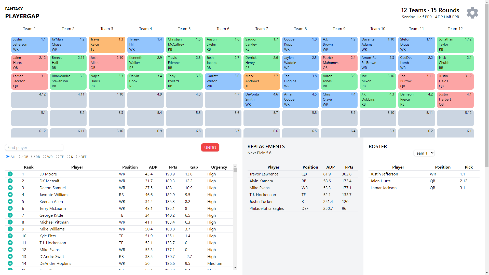

# Fantasy Player Gap

[Live Site](https://fantasy-player-gap.vercel.app/)

Fantasy Football drafting tool that dynamically ranks players based on the current draft state. 
Follow along with your league's picks and find out who are the most valuable players.

 

## Tech Stack

### Frontend

- React
- TanStack Query
- TanStack Table
- Tailwind CSS

### Backend → [Repo](https://github.com/ecortesg/fantasy-api)

- Node.js
- Express
- Mongoose

### Database

- MongoDB
